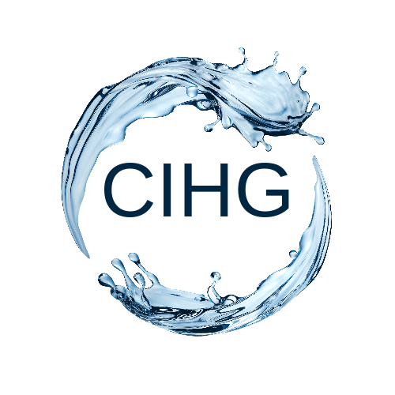

# Computational and Integrated Hydrology Group



Official group website repository for CIHG at Utah State University.

This is built from Jekyll using the [al-folio](https://github.com/alshedivat/al-folio) template. For more information on how to use the template to build a website, see my [blog post](https://hydroaggie.github.io/blog/2023/Create-Your-Personal-Website-Using-Github-Pages/).

## How to build a website for an academic group?
The [al-folio](https://github.com/alshedivat/al-folio) template allows you to build a personal website easily. However, the current template does not include elements (e.g., a team page) for a group website. Fortunately, it is relatively straightforward to add another page in the template, and I found the [diagnostics group](https://inbt.jhu.edu/epidiagnostics/) and [Programming Group](https://programming-group.com/) beautifully demonstrated this with a dedicated Team page. I was only able to find the [source code](https://github.com/hunky-d0ry/hunky-d0ry.github.io) for the [diagnostics group](https://inbt.jhu.edu/epidiagnostics/), which is on GitHub. So I incorporated the changes made in that GitHub repo into my group website.

Here I will demonstrate the steps I took to add a Team page. 
- Create `_members` folder under root directory. Inside the `_members`, create a markdown file for each member of your group ([example](https://github.com/hydroaggie/hydroaggie.github.io/tree/master/_members)). Note that the members are organized into different groups (e.g., faculty, graduate students, post-doc, etc.) and are ordered based on the keyword `group_rank` in the header. 
- Create a `team.md` file inside `_pages` folder. This is the file that lists all members of the group. The only thing you will want to change is the path to the profile pictures (default: `/assets/img/team/`). You need to create such path under `assets` and put related profile pics. 
- Add team css class in `_sass/_base.scss`. Add the following class to the file (can be placed anywhere).

```bash
// Team

.team {
  .card-body {
    a:first-of-type {
      text-decoration: none;
    }
   padding: 13.5px;
  }
}
```

- Add collections in `_config.yml`. Put the `members` following under `collections:`. **This is important for members to show up on Team page.**

```bash
collections:
  news:
    defaults:
      layout: post
    output: true
    permalink: /news/:path/
  projects:
    output: true
    permalink: /projects/:path/
  members:
    output: true
    permalink: /members/:path
```

- Rebuild the website. Voila! Your new group website is up and running.

## License

The theme is available as open source under the terms of the [MIT License](https://github.com/alshedivat/al-folio/blob/master/LICENSE).

Originally, **al-folio** was based on the [\*folio theme](https://github.com/bogoli/-folio) (published by [Lia Bogoev](https://liabogoev.com) and under the MIT license). Since then, it got a full re-write of the styles and many additional cool features.
